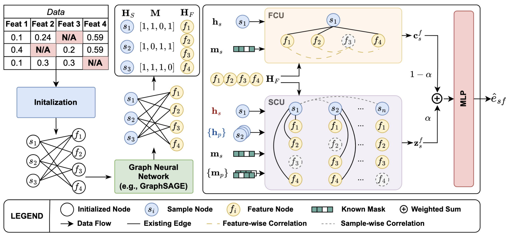
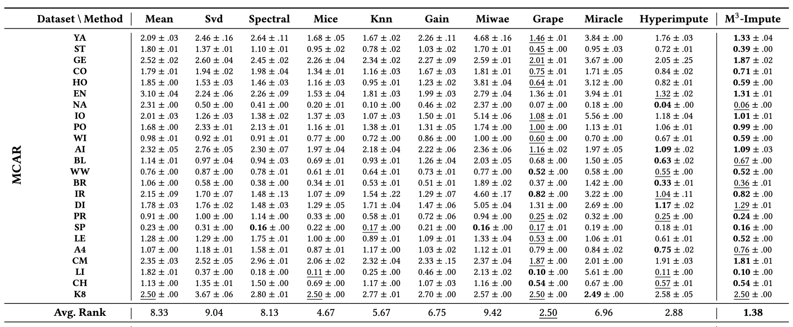

# $M^3$-Impute: Mask-guided Representation Learning for Missing Value Imputation

This repository is the official implementation of [$M^3$-Impute: Mask-guided Representation Learning for Missing Value Imputation](https://arxiv.org/abs/2410.08794). 



The $M^3$-Impute codebase is based on [GRAPE codebase](https://github.com/maxiaoba/GRAPE), we implements the model in `models/gnn_model.py` and the `models/prediction_model.py` files. The experiments is start via `train_mdi.py`.

## Requirements & Setup

We conduct our experiment on a server with following environments:

- Ubuntu `22.04`
- CUDA `12.1`
- conda `23.9.0`
- Python `3.11.6`
- Torch `2.1.0` & Torchvision `0.16.0` (Usually need to install manually to make sure the library can utilize GPU)

After you prepare your environments, you can install other requirements:

```setup
pip install -r requirements.txt
```

Finally, you need to install `pytorch scatter`. Here are the install command for our environment, you can refer to the documentation and your setting to select the install version.

```setup
# GPU
pip install pytorch-scatter -f https://data.pyg.org/whl/torch-2.1.0+cu121.html

# CPU
pip install torch-scatter -f https://data.pyg.org/whl/torch-2.1.0+cpu.html
```

### Dataset

The datasets used in this work can obtains online or import from the suppmentary material we provide. All datasets should place inside the `uci/raw_data` folder.

- UCI (8 datasets): https://github.com/maxiaoba/GRAPE/tree/master/uci/raw_data
  - concrete, energy, housing, kin8nm, naval, power, wine, yacht
- Extra 17 datasets: 
  - airfoil, blood, breast, diabetes, ionosphere, iris, wine-white, protein, spam, letter, abalone, ai4i, cmc, german, steel, libras, california-housing


Expected folder structure:

```
├── uci
│   ├── __init__.py
│   ├── raw_data
│   │   ├── abalone
│   │   ├── ai4i
│   │   ├── airfoil
│   │   ├── blood
│   │   ├── breast
│   │   ├── california-housing
│   │   ├── cmc
│   │   ├── concrete
│   │   ├── diabetes
│   │   ├── energy
│   │   ├── german
│   │   ├── housing
│   │   ├── ionosphere
│   │   ├── iris
│   │   ├── kin8nm
│   │   ├── letter
│   │   ├── libras
│   │   ├── naval
│   │   ├── power
│   │   ├── protein
│   │   ├── spam
│   │   ├── steel
│   │   ├── wine
│   │   ├── wine-white
│   │   └── yacht
│   ├── uci_data.py
│   └── uci_subparser.py
```


## Training & Evaluation

We provide the startup parameters used in the M3-Impute experiment, and all options and parameters are specified in the `.sh` file in root folder. For more training options, look at the arguments in `train_mdi.py` and `uci/uci_subparser.py`.

### 1. Experiment 1 (Table 1 in the manuscript, Table 7 & 8 in the appendix)

> Imputation under different simulated missingness senario.

```train
bash run_exp1_impute.sh       # MCAR
bash run_exp1_impute_mar.sh   # MAR
bash run_exp1_impute_mnar.sh  # MNAR
```

### 2. Experiment 2 (Figure 3 in the manuscript, Table 16 ~ 21 in the appendix)

> Robustness against various ratios of missingness.

```train
bash run_exp2_robust.sh
```

### 3. Experiment 3 (Ablation: Table 2 in the manuscript, Hyperparameter: Table 3 in the manuscript)

> Ablation study and hyperparameter explore

```train
bash run_exp3_ablation.sh
```

### 4. Baselines

```
python baseline_mdi.py --method mean uci --train_edge 0.7 --data yacht
```

### 5. DownStream Task

```
python downstream_task.py --method mean
python downstream_task.py --method m3-impute
```

## Results

Our model achieves the following performance on 8 UCI datasets:




## Licence

MIT
